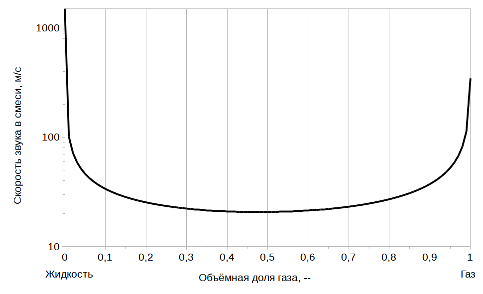

Модель гидродинамики водокольцевого насоса
==========================================

Важным направлением, заслуживающим интереса, является моделирование двухфазных течений в гомогенном сжимаемом приближении. Такие модели могут быть полезными для первичной оценки интегральных характеристик устройств со смешением потоков сред с большим отношением плотностей (например, вода и воздух). Кроме того, сжимаемые модели позволяют оценить пульсации давления и, следовательно, уровень шума, что также является актуальной инженерной задачей.

Разработанный [гибридный метод расчета сжимаемых течений](../../3/Ru/001-Ru-hybridCentralSolvers.html), реализованный на основе открытого пакета OpenFOAM, был адаптирован для решения задач движения двухфазных сжимаемых смесей в гомогенном односкоростном приближении. В рамках данной модели к системе уравнений, описывающей движение среды и состоящей из уравнений баланса массы, импульса и энергии, было добавлено уравнение переноса массовой доли жидкой фазы $Y_{Liq}$:

\begin{equation*}
\frac{\partial \rho Y_{Liq}}{\partial t} + \nabla \cdot \left ( \vec U \rho Y_{Liq} \right ) = 0
\end{equation*}

Плотность смеси $\rho$ вычисляется через термодинамические плотности компонент 
$\rho_{Liq}$, $\rho_{Gas}$ и их массовые доли $Y_{Liq}$, $Y_{Gas}$:

\begin{equation*}
\rho = 
\left (
\dfrac{Y_{Liq}}{\rho_{Liq}}
+
\dfrac{Y_{Gas}}{\rho_{Gas}}
\right )^{-1},
\end{equation*}

Индексы "Liq" и "Gas" соответствуют жидкой и газовой компонентам двухфазной смеси.

Изоэнтропийная скорость распространения возмущений в такой среде вычисляется следующим образом:

\begin{equation*}
c 
=
\sqrt {\gamma \frac{\partial p}{\partial \rho}}
=
\sqrt
{
\frac{\gamma}{\rho^2}
\left ( 
\frac{Y_{Liq}}{\rho_{Liq}^2} \frac{\partial \rho_{Liq}}{ \partial p}
+ \frac{Y_{Gas}}{\rho_{Gas}^2} \frac{\partial \rho_{Gas}}{ \partial p}
\right )^{-1}
}
\end{equation*}

В этом случае в приближении гомогенной смеси жидкости и газа уравнение состояния будет 
немонотонной функцией относительно объёмной доли одной из фаз (см. рис. ниже). К примеру, для гомогенной двухфазной смеси пара и воды скорость звука будет немонотонно меняться в пределах расчётной области от заранее известных значений (350 м/с для пара, 1500 м/с для воды) до довольно малых величин порядка 20 м/с (в случае равных объёмных долей компонент смеси) при атмосферном давлении и комнатной температуре.

{width=35%} 

*Зависимость скорости звука от объемной доли газа в двухкомпонентной смеси "пар-вода"*

Одним из приложений рассмотренной гомогенной модели является моделирование водокольцевых насосов, которые 
используются в энергетике для создания разрежения высокой степени. Моделирование таких устройств обычно осуществляется либо в несжимаемом приближении, 
либо с использованием уравнений состояний (например, политропного), не учитывающих изменения реальных свойств смеси в
зависимости от её состава. Тем не менее, корректный учёт скорости распространения акустических возмущений может быть
критически важным для анализа шумности таких машин.

Принцип работы насоса (см. рис. ниже) относительно прост и базируется на двух законах — законе сохранения массы 
и законе сохранения импульса. Ротор машины (1) размещён с эксцентриситетом относительно статорной части (3), имеющей цилиндрическую форму. При вращении ротора жидкость в рабочей части (2) за счёт центробежных сил «разбрасывается» к периферии, образуя между валом ротора и межфазной поверхностью жидкий кольцевой канал переменного сечения. При проталкивании прокачиваемой среды (газа) лопастями ротора через расширяющуюся часть жидкого кольцевого канала происходит расширение среды и, как следствие, создаётся разрежение на всасе. Затем кольцевой канал сужается и проталкивание газа через него приводит к росту давления на выходе из насоса.

{width=35%} 

*Схема работы и устройства рабочей части водокольцевого насоса. 
Синим цветом показана жидкость, создающая сужающийся-расширяющийся канал, 
белым цветом — пространство для прохождения прокачиваемого газа, 
зелёными точками отмечен входящий поток среды, 
красными точками — уходящий поток среды*

В работе в качестве модели для тестирования решателя была выбрана конструкция, близкая к реальной, переданная 
Dr. Jörn Beilke. Для соединения подвижных и неподвижных частей модели использовались поверхности интерполяции
данных. Для этого между соответствующими частями создавался зазор, который выбирался либо исходя из конструкторской документации,
либо из соображений снижения времени расчёта (чем тоньше слой, тем больше время счёта). В начальный момент времени расчётная 
область была «залита» жидкостью согласно её предполагаемому положению при работе на номинальной мощности. Скорость вращения
вала увеличивалась ступенчатой функцией от 0 до 200 рад/с, давление на всасе снижалось с 100 кПа до 60 кПа. В результате расчёта
были получены распределения полей давления, скорости и объёмной и массовых долей в водокольцевом насосе (см. рис. 
ниже). Сделана оценка подачи при скорости вала 200 рад/с, перепаде давлений 40 кПа — 5 м3/ч. Сравнивая данную 
оценку с экспериментальной величиной для перепада 40 кПа — 16 м3/ч при скорости вращения вала 298 рад/с, 
можно сделать вывод о качественно правильном воспроизведении явлений с помощью данной модели, поскольку:

+ переход с частоты вращения 298 рад/с до 200 рад/с при сохранении перепада должен снизить 
  подачу по крайней мере на 1/3;
+ величина зазора между вращающимся ротором и подводящими/отводящими патрубками в натурном изделии значительно 
  меньше, чем заданная в модели (в несколько раз), что, очевидно, сказывается на увеличении модельных протечек.

Качественный анализ течения, выполненный по разработанной модели, учитывающей немонотонную
зависимость скорости звука от объёмной доли газа, показывает наличие трансзвуковых зон в областях с объёмной долей 
воздуха около 50%.

{width=25%} 
{width=25%} 

*Качественная картина течения в водокольцевом насосе, слева направо: поле статического давления, поле объёмной 
доли жидкости, эффективное число Маха, поле модуля скорости*

Таким образом, учет сжимаемости и <<немонотонного>> уравнения состояния в модели течения показывает, что
даже при сравнительно малых скоростях среды могут наблюдаться эффекты, характерные для транс- и сверхзвуковых течений,
и связанные с ними явления.

Визуализация течения в водокольцевом вакуумном насосе
-----------------------------------------------------

<iframe width="640" height="480"
src="https://www.youtube.com/embed/xCAaAHuSxSE">
</iframe>

