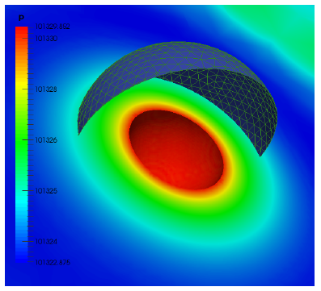

Computational Aeroacoustics Methods with OpenFOAM v.4.1
--------------------------------------------------------

**Instructor:** Viktoria Korchagova, ISP RAS (Russia)

**Training type:** Advanced

**Session type:** Lecture & hands-on

**Software stack:** OpenFOAM 4.1

**Developers of this session:**

* V. Korchagova, Russia
* M. Kraposhin, Russia
* S. Strijhak, Russia

**Development team website:** <http://unicfd.ru>

**Presentation language:** English

**Description:**

The noise level reduction is an actual task in aerospace,
aviation, marine and automobile industries. There are a lot
of different numerical approaches which can be used for
noise prediction, for example direct noise computation 
using finite difference method; finite volume method with 
hybrid RANS/LES techniques; discontinuous Galerkin method;
solution of linearized Euler equations; wave equation; acoustic 
analogies. The domain of applicability of the last two 
approaches is restricted mainly by far-field noise prediction, 
whereas first two can be used for simulation of non-linear 
effects in the near-field regions of the flow. Results of 
simulations in the near-field can be used as input data for 
far-field models. 

The training session will start with a short introduction 
to computational aeroacoustics, employed numerical methods 
and review of capabilities implemented in **libAcoustics** 
library together wih simple examples for verification.

Current implementation of **libAcoustics** library consists 
of the following modules for CAA analysis:

* Curle analogy for noise prediction generated by unsteady 
subsonic flow around fixed obstacles;
* Ffowcs-Williams and Hawkings analogy for noise prediction 
generated by unsteady subsonic and supersonic flows around 
fixed and moving obstacles or jets;
* Wave equation solution in the frequency domain with 
Boundary Element Method (BEM) for far-field simulations 
in linear approximation.

All capabilities are implemented in the library using 
_functionObjects_ or _applications_ providing interfaces 
to third party libraries (like **BEM++**) if needed. 

Key points of the training track are the discussion 
of details of implementation for different modules in 
**libAcoustics** and verification examples running: noise 
generated by monopole (see figire below), dipole 
and cylinders in tandem.
After discussion attendees will be prompted to run this 
cases with their own parameters.

Results of BEM solution to Helmholtz equation are shown
on figure below.

It is possible to compare different methods within the
scope of **libAcoustics** library for monopole test -
see figure below.

The attendees will require good knowledge of setting up cases, running/modifying tutorial cases as 
well as basic understanding of programming/compiling OpenFOAM source code. This module will 
be hands-on. The attendees will require a laptop with a current OpenFOAM installation or - 
preferably - be able to boot the conference USB stick.

Materials of this tutorial are located at git archive and can be downloaded from <http://www.github.com>

* For OpenFOAM 4.1 at <https://github.com/unicfdlab/TrainingTracks/tree/master/OpenFOAM/libAcoustics-OF4.1>

