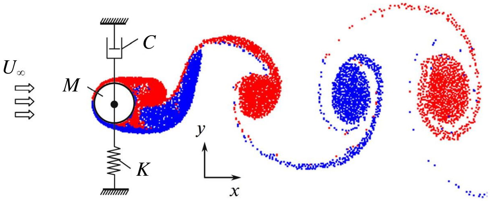

Implementation of simple FSI model with functionObject
------------------------------------------------------

**Instructor:** Ilia Marchevsky, PhD, assoc. prof., BMSTU (Russia)

**Training type:** Intermediate

**Session type:** Hands-on

**Software stack:** OpenFOAM 4.1, OpenFOAM 3.0.x

**Developers of this session:**

* I. Marchevsky, Russia

* M. Kraposhin, Russia

**Development team website:** <http://unicfd.ru>

**Presentation language:** English

**Description:**

The training session begins with short introduction to fluid-structure interaction (FSI) problems,
overview and classification of cases which arises in real world. One of the most simple and 
common cases of FSI is the weakly coupled motion with 1-2 degrees of freedom of solid body in 
fluid flow. This one has been selected for demonstration of OpenFOAM's capability to create complex 
numerical FSI models. In this course the particular real-world example is considered – flow-induced 
vibration of cylinder, connected to one or two linear viscous-elastic springs, see next figure. 
Mathematical model is formulated for this case.

With respect to this example, different approaches for solution of this problem are discussed. 
Difference between the custom solver,  functionObject and fvOption classes is presented in discussion. 
The choice of standard OpenFOAM solver pimpleDyMFoam coupled with functionObject for the solution of the 
current case is argued. The development procedure steps of user-defined functionObject is presented: setup 
of the custom dynamic library, creation of class which inherits the standard OpenFOAM library “forces”, 
mesh motion issues, coordinate system transformation, restarts implementation from stored time points , etc.
During the track we will compile our FSI class and will run simulation with the new library. 

After running simulation, we will obtain evolution of hydrodynamic fields (velocity and pressure)
and position of cylinder's boundary - see animation.

<iframe width="420" height="315"
src="https://www.youtube.com/embed/s3IM-g6tPK8">
</iframe>

<iframe width="420" height="315"
src="https://www.youtube.com/embed/tosM8sNfkho">
</iframe>

Then results 
of FSI simulation will be compared to experimental observations and results of other codes.

The attendees will require good knowledge of setting up cases, running/modifying tutorial cases as well as 
basic understanding of programming/compiling source code. This module will be hands-on. The attendees will require a 
laptop with a current OpenFOAM installation or - preferably - be able to boot the conference USB stick.

Materials of this tutorial are located at git archive and can be downloaded from <http://www.github.com>

* For OpenFOAM 4.1 at <https://github.com/unicfdlab/TrainingTracks/tree/master/OpenFOAM/simpleFsi-OF4.1>
* For OpenFOAM 3.0.0 at <https://github.com/unicfdlab/TrainingTracks/tree/master/OpenFOAM/simpleFsi-OF3.0.0>

