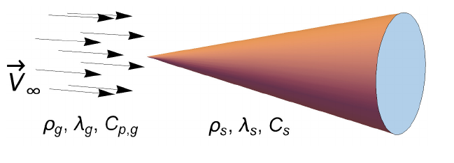

Implementation of the solver for coupled simulation for heat transfer in gas and solid
--------------------------------------------------------------------------------------

**Instructor:** Ilia Marchevsky, PhD, assoc. prof., BMSTU (Russia)

**Training type:** Intermediate

**Session type:** Hands-on

**Software stack:** OpenFOAM 4.1

**Developers of this session:**

* I. Marchevsky, Russia
* M. Kraposhin, Russia

**Development team website:** <http://unicfd.ru>

**Presentation language:** English

**Description:**

The existing **chtMultiRegionFoam** / **chtMultiRegionSimpleFoam** solvers make it possible
 to solve coupled heat transfer problems in flow and solid but only at low Mach number 
 for deep subsonic flows. In practice it is important to consider the same problem
 for wide range of the Mach number, both for subsonic and supersonic flows. Moreover, 
 for real geometries in the computational domain we have to deal with sub- and 
 supersonic regions of unsteady shape.

For gas dynamics simulation in such problems an efficient OpenFOAM solver **pimpleCentralFoam** 
has been developed (<https://github.com/unicfdlab/hybridCentralSolvers/tree/master/OpenFOAM-4.1>) 
which uses hybrid Godunov-type / PIMPLE all Mach number approach for compressible flows.

The aim of this training session is to show how to combine the advantages of 
coupling heat transfer scheme implemented in *chtMultiRegionFoam* with capabilities 
of **pimpleCentralFoam** solver. 

The following questions will be pointed:

1) brief review of source code structure of the mentioned solvers;
2) how to couple numerical models for heat transfer in gas and solid;
3) test problems choice and simulations running.

During the track we will compile our **myChtPimpleCentralFoam** solver and run simulation with it. 

The attendees will require good knowledge of setting up cases, running/modifying tutorial cases as 
well as basic understanding of programming/compiling OpenFOAM source code. This module will 
be hands-on. The attendees will require a laptop with a current OpenFOAM installation or - 
preferably - be able to boot the conference USB stick.

Materials of this tutorial are located at git archive and can be downloaded from <http://www.github.com>

* For OpenFOAM 4.1 at <https://github.com/unicfdlab/TrainingTracks/tree/master/OpenFOAM/gasThermoCoupled-OF4.1>

