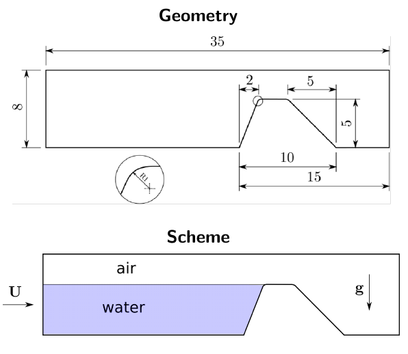
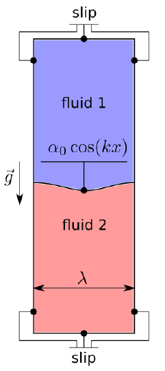

Как решать задачи моделирования течений со свободной поверхностью в OpenFOAM® 4.1
=================================================================================

**Преподаватель:** Виктория Корчагова, ИСП РАН (Россия)

**Сложность модуля:** Средняя

**Тип модуля:** Лекция с примерами

**Программное обеспечение:** OpenFOAM 4.1, OpenFOAM 3.0.x

**Разработчики модуля:**

* В. Корчагова, Россия

**Язык презентации:** English

**Описание:**

В связи с изменениями, внесёнными в OpenFOAM версий 2.3+ в численную схему для расчёта
течений с межфазной поверхностью, важно понимать, каким образом правильно настроить параметры численной схемы в разных версиях программного комплекса и как эти настройки влияют на получаемое решение. 
Целью данного учебного курса является анализ настроечных
параметров решателя **interFoam** для корректного решения задачи
моделирования течения со свободной поверхностью.

Первая часть занятия представляет собой
лекцию о внутренней структуре решателя **interFoam** и о математической модели, заложенной в нем.
Во второй части занятия преподаватель вместе со слушателями выполняет тестовые задачи и анализирует полученные результаты.
В качестве тестовых примеров рассматриваются задачи моделирования водосброса (Spillway) и неустойчивости
Рэлея-Тэйлора (см. рис. ниже).

{width=100%}
{width=100%}

План учебного курса выглядит следующим образом.

1. Введение: актуальность задач моделирования течений со свободной поверхностью; обзор ключевых моментов учебного курса
(почему основное внимание уделяется граничным условиям, используемым в OpenFOAM).
2. Описание математической модели течения жидкости со свободной поверхностью.
3. Обзор принципов работы и внутренней структуры решателя **interFoam**.
4. Описание базового тестового примера модели водосброса "Spillway".
5. Этапы настройки и запуска базового кейса "Spillway" для решения задачи водосброса жидкости средствами OpenFOAM версии 4.1:
    (a) построение базовой сетки: утилита **blockMesh** и настроечный файл blockMeshDict;
    (b) формирование сетки для 2D-задачи в области с геометрией сложной формы: утилиты **snappyHexMesh** и **extrudeMesh**;
    (c) настройка граничных условий для гидродинамических величин (объёмная доля жидкости, скорость, давление);
    (d) настройка начального распределения жидкости в расчетной области: утилита setFields, файл setFieldsDict;
    (d) настройка численных схем и параметров запуска: файлы controlDict, fvSchemes и fvSolution;
    (e) запуск **interFoam**, сопоставление результатов, полученных в различных версиях
        OpenFOAM; результаты зафиксированы на видеоролике (см. ниже).
5. Закрепление пройденного: моделирование гидродинамической неустойчивости Рэлея-Тэйлора. Результат расчета зафиксирован в видеоролике (см. ниже).
6. Подведение итогов и обсуждение.

<iframe width="420" height="315"
src="https://www.youtube.com/embed/OHoaa4xCMeM">
</iframe>

<iframe width="420" height="315"
src="https://www.youtube.com/embed/mwarxIXO_Q0">
</iframe>

Учебные материалы находятся в свободном доступе и могут быть загружены
с ресурса <http://www.github.com>:

* Для OpenFOAM 4.1 - на <https://github.com/unicfdlab/TrainingTracks/tree/master/OpenFOAM/freeSurfaceFlows-0F4.1>
* Для OpenFOAM 3.0.0 - на <https://github.com/unicfdlab/TrainingTracks/tree/master/OpenFOAM/freeSurfaceFlows-0F3.0.0>

